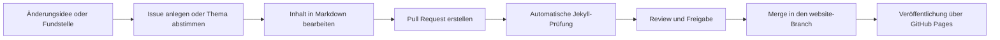

# Schachverein Dresden-Striesen e.V.

Diese Website wird mit GitHub Pages und Jekyll erstellt und automatisch bereitgestellt. Sie enthält alle notwendigen Dateien und Konfigurationen für die automatische Veröffentlichung bei Änderungen.

**Live-Website:** [www.sv-dresden-striesen.de](https://www.sv-dresden-striesen.de)

## Projektstruktur

- **_config.yml**: Jekyll-Konfiguration für GitHub Pages
- **index.md**: Hauptseite der Website
- **pages/**: Inhaltsseiten des Vereins
- **files/**: Dateien, Bilder und Dokumente
- **data/navigation.yml**: Menü der Webseite
- **CNAME**: Konfiguration des Domainnamen der Webseite. Achtung, muss auch im DNS entsprechend konfiguriert sein.
- **.devcontainer/**: Vorlage für Entwicklungsumgebung (z.B. in [VS Code](https://code.visualstudio.com/docs/devcontainers/faq))

### Deployment

Änderungen werden automatisch über GitHub Actions veröffentlicht, wenn sie in den `website`-Branch gepusht werden.

### GitHub Copilot Support

Das Repository enthält eine Copilot-Setup-Workflow (`.github/workflows/copilot-setup-steps.yml`), der die Jekyll-Entwicklungsumgebung für GitHub Copilot-Agenten vorbereitet.
Dies ermöglicht es Copilot, Ruby-Dependencies automatisch zu installieren und die Jekyll-Build-Umgebung einzurichten.

## Mitwirkung

Beiträge sind willkommen! Bitte erstellen Sie einen Pull Request oder öffnen Sie ein [Issue](https://github.com/Schachverein-Dresden-Striesen/Schachverein-Dresden-Striesen.github.io/issues) für Vorschläge oder Verbesserungen.
Aktueller Webseite-Meilenstein: [Milestones](https://github.com/Schachverein-Dresden-Striesen/Schachverein-Dresden-Striesen.github.io/milestone/1).

### Von der Idee bis zur Veröffentlichung

Unser Mitwirkungsprozess ist bewusst offen und nachvollziehbar. Wer ähnliche redaktionelle Workflows sucht, findet eine gute Einordnung auch im README der [Finanzordnung der Deutschen Schachjugend](https://github.com/Schachjugend/Finanzordnung/blob/master/README.md), das auf [bundesgit](https://github.com/bundestag/gesetze) verweist.



Kurz gesagt: Idee notieren, Änderung vorschlagen, automatisch prüfen lassen und anschließend veröffentlichen.


Bei Fragen schaue auch durch die 
- [Historie an Pull-Requests](https://github.com/Schachverein-Dresden-Striesen/Schachverein-Dresden-Striesen.github.io/pulls?q=is%3Apr) 
- [einzelnen Änderungen](https://github.com/Schachverein-Dresden-Striesen/Schachverein-Dresden-Striesen.github.io/commits/website/)

beziehungsweise wende dich gerne an [unser Team](https://github.com/Schachverein-Dresden-Striesen/Schachverein-Dresden-Striesen.github.io/people) 😊.

> **Neu bei GitHub?** Lies zuerst unseren [GitHub-Einstiegsleitfaden](GITHUB-EINSTIEG.md), um die Grundlagen zu verstehen. 

## Lokale Entwicklung

### Voraussetzungen

**Option A – GitHub Codespaces:** kein lokales Setup erforderlich, nur ein GitHub-Account

**Gemeinsame Voraussetzungen für Option B und C:**

- [Git](https://git-scm.com/)

**Option B – VSCode mit Devcontainer (zusätzlich):**

- [VSCode](https://code.visualstudio.com/)
- [Docker](https://www.docker.com/)

**Option C – Lokale Installation (zusätzlich):**

- Ruby (Version 2.7 oder höher)
  - Windows: [RubyInstaller](https://rubyinstaller.org/)
  - macOS: `brew install ruby` (mit [Homebrew](https://brew.sh/))
  - Linux: Paketmanager Ihrer Distribution verwenden

### Setup

1. **Repository klonen** *(nur für Option B und C nötig)*:

Zum Beispiel in `PowerShell` via [Git](https://git-scm.com/):

```bash
# Herunterladen in den aktuellen Datei-Ordner unter "Schachverein-Dresden-Striesen.github.io"
git clone https://github.com/Schachverein-Dresden-Striesen/Schachverein-Dresden-Striesen.github.io.git

# Wechseln in den heruntergeladenen Ordner:
cd "Schachverein-Dresden-Striesen.github.io"
```

2. **Entwicklungsumgebung wählen:**

   **Option A: GitHub Codespaces (kein lokales Setup nötig)**

   [GitHub Codespaces](https://docs.github.com/de/codespaces/overview) startet eine vollständige Entwicklungsumgebung direkt im Browser – keine lokale Installation erforderlich.

   - Auf der Repository-Seite: **Code → Codespaces → Codespace erstellen auf ...**
   - Oder per [GitHub CLI](https://cli.github.com/): `gh codespace create`
   - Die Umgebung basiert auf `.devcontainer/devcontainer.json` und startet fertig konfiguriert mit allen Abhängigkeiten

   > **Kosten:** Jeder GitHub-Account bietet ein monatliches [kostenloses Kontingent](https://docs.github.com/de/billing/concepts/product-billing/github-codespaces#free-quota) (Kernstunden + Speicher). Nach Überschreitung des Kontingents können Kosten entstehen. Weitere Informationen unter [Codespaces-Abrechnung](https://docs.github.com/de/billing/concepts/product-billing/github-codespaces).

   **Option B: VSCode mit Devcontainer (empfohlen)**

```bash
code .
```

- VSCode wird automatisch vorschlagen, den Container zu öffnen
- Oder: `F1` → "Dev Containers: Reopen in Container"
- Abhängigkeiten werden automatisch installiert

   **Option C: Lokale Installation**

```bash
gem install bundler
bundle install
```

3. **Website starten**:

```bash
# Mit Standard-Konfiguration:
bundle exec jekyll serve
```

Die Website ist dann unter `http://localhost:4000` erreichbar.

### Inhalte bearbeiten

- Bearbeiten Sie Markdown-Dateien (`.md`) in VSCode oder Ihrem bevorzugten Editor
- **Oder direkt in GitHub über die Weboberfläche**
- Änderungen werden automatisch beim Speichern übernommen (Live-Reload)
- Neue Seiten können im `pages/` Verzeichnis erstellt werden
